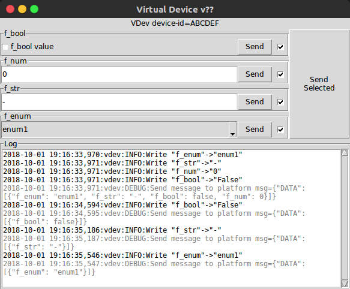

# Virtual Device

VDev is a software implementation of a compatible device with Fanap IoT platform based on `FNP.PLF.PUB.SystemSpecificationIoTAPI.00` api. 
VDev communicates with platform through MQTT.

## Requirements
  - python3
  - paho-mqtt


## How to Use

Set device and platform parameters in json file.
Use `device.json` and `plat.json` as template.

### Device JSON
Example for device description:
```json
{
  "device_id": "ABCD",
  "enc_key": "123456", 
  "enc_enable": false,
  "description":"Optional description for device",
  "attributeTypes": [
    {"name":"f_bool", "type":"Boolean"},
    {"name":"f_num", "type":"Number"},
    {"name":"f_str", "type":"String"},
    {"name":"f_enum", "type":["enum1", "enum2"]}
  ]
}
```

- `device_id` can be replaced by `-D` argument from command line
- `enc_key` cand be replaced by `-k` argument from command line
- Encryption key `enc_key` should be 8 byte string

### Platform Description
Example file for platform setup:

```json
{
  "mqtt" : {
    "host":"localhost",
    "port":1883,
    "user":"",
    "pass":""
  }
}
```

## Operational Mode 

VDev can be used in tow mode:
- **Tx Mode** Push device data to the platform.
- **Subscribe Mode** Subscribe to MQTT for getting commands from platform. In GUI mode user can change device data and update the platform.


To run VDev use `run_vdev` in terminal. Check command line arguments with:
    
    ./run_dev -h

```console
usage: run_vdev [-h] [-p platform_file] [-d device_file] [-D device-id]
                [-k encryption-key] [-txmodule script.py] [-gui] [-loop]
                [param_value [param_value ...]]

Virtual Device simulator

positional arguments:
  param_value          Commands for sending to the platform. Format
                       PARAM=VALUE, use PARAM=\"STRING_VAL\" for string
                       values.

optional arguments:
  -h, --help           show this help message and exit
  -p platform_file     Platform JSON file. Default=plat.json
  -d device_file       Device JSON file. Default=device.json
  -D device-id         Set device-id. Overwrites "device_id" in device json
                       file.
  -k encryption-key    Set device encryption-key. Overwrites "enc_key" in
                       device json file.
  -txmodule script.py  Simulate sending periodic data from device to platform.
                       Content and period is determined in script-file
  -gui                 Show gui in subscribe mode
  -loop                Loop two multiple vdev through MQTT. Looped device acts
                       as a platform
```

## Tx Mode
In simple mode data for platform, determined in command line. Use `NAME=VALUE` for 
updating field `NAME` with `VALUE` in platform. Multiple data/value pair can be use in single command.

    ./run_dev NAME=VALUE NAME2=VALUE2

For each data type consider following format

- **String** `NAME=\"asdf\"` (Use \\" to prevent terminal replacement)
- **Enum** Same as string
- **Number** Use ordinary number values
- **Boolean** Use `true` or `false`

Example:

    ./run_dev string_field=\"value1\" number_field=-23.24 boolean_field=false enum_field=\"VALUE\"

For sending periodic data `-txmodule` can be used. In this mode a python script is 
provided for generating periodic data.

    ./run_dev -txmodule test_scenario.py

```python
# test_scenario.py
import random

# Send incremental numeric value every 200 milliseconds
def gen_NAME2(dev_type_dic, user_data={}):
    cnt = 0
    while True:
        yield ({"f_num":cnt},  0.2)
        cnt += 1

# Toggle boolean field. Time interval is normal distribution (mean=2 deviation=1)
def gen_NAME1(dev_type_dic, user_data={}):
    while True:
        yield ({"f_bool":True},  random.normalvariate(2,1))
        yield ({"f_bool":False}, random.normalvariate(2,1))
        

# Randomly select enum value and send every 1.2 sec
def gen_NAME3(dev_type_dic, user_data={}):
    for i in range(10):
        yield ({"f_enum":random.choice(['enum1','enum2'])}, 1.2)
```

- Name of each stream starts with `gen_`
- Each stream function should use `yield` for data return
- Return should be tuple `(data_dict, delay_time_sec)`


## Subscribe Mode
In subscribe mode, VDev listens for messages from platform.

    ./run_vdev -d device.json -p platform.json

```console
2018-10-01 19:10:00,923:vdev:INFO:Connect to localhost:1883
2018-10-01 19:10:00,923:vdev:INFO:Subscribe to XXXX/p2d
2018-10-01 19:10:26,641:vdev:INFO:Write "f_num"->"456"
2018-10-01 19:10:26,641:vdev:DEBUG:Send message to platform msg={"DATA": [{"f_num": 456}]}
...
...
```

For sending data to the platform, gui mode can be used. Gui is enabled with `-gui` switch.

    ./run_vdev -gui -d device.json -p platform.json




